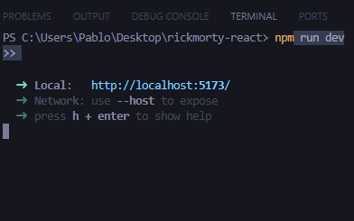
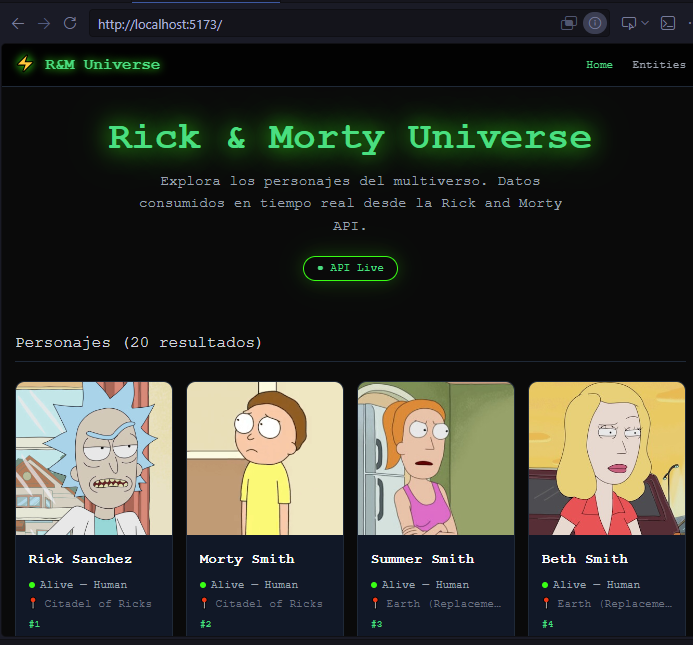
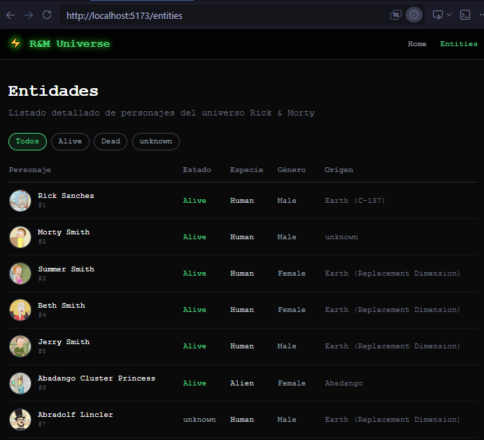
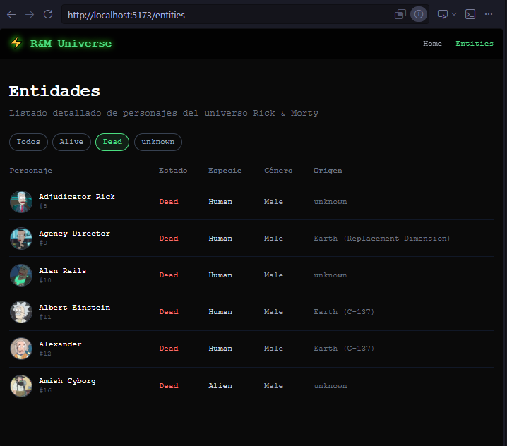
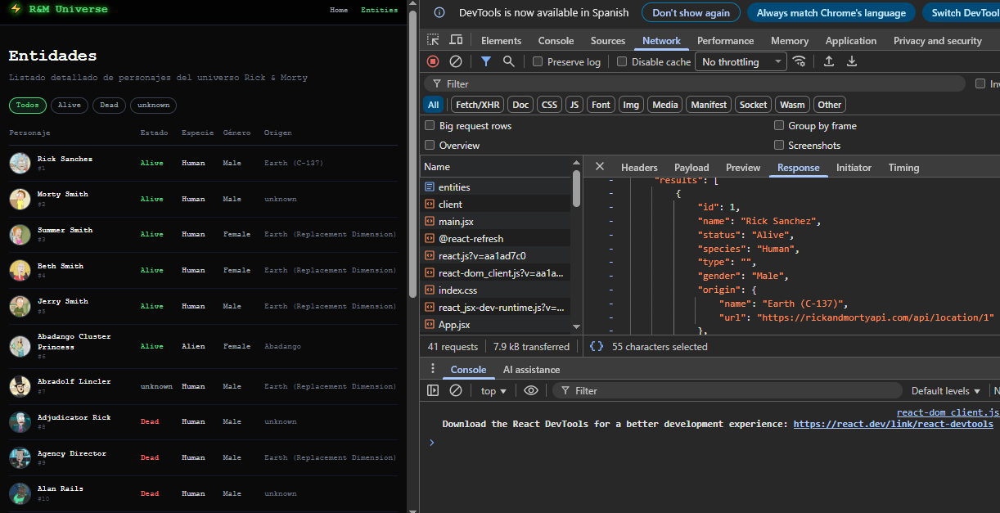
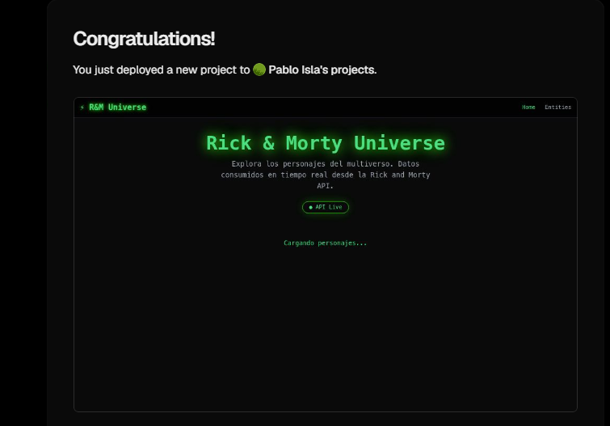

# 🛸 Rick & Morty Universe

App React que consume la Rick and Morty API pública.

## 📌 Tecnologías
- React 19 + Vite
- React Router DOM
- Tailwind CSS v3

## 🚀 Ejecutar

```bash
git clone https://github.com/TU_USUARIO/rickmorty-react.git
cd rickmorty-react
npm install
npm run dev
```

🌐 Deploy: https://rickmorty-react-xxx.vercel.app  
📹 Video: https://youtube.com/TU_LINK

---

## Evidencias

### E1 — Proyecto corriendo con Vite


### E2 — Ruta "/" Home con hero y personajes


### E3 — Ruta "/entities" con tabla


### E4 — Filtro por estado activo


### E5 — Consumo de API (DevTools Network)


### E6 — Deploy en Vercel
